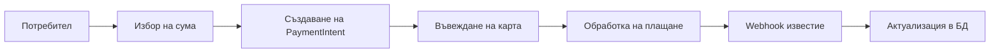

# Stripe Интеграция в 65 Roses

## Съдържание
1. [Какво е реализирано](#какво-е-реализирано)
2. [Как работи](#как-работи)
3. [Текущи функционалности](#текущи-функционалности)
4. [Предстоящи задачи](#предстоящи-задачи)
5. [Техническа документация](#техническа-документация)

## Какво е реализирано

### 1. Основна интеграция със Stripe
- Настроена връзка със Stripe API
- Конфигурирани webhook събития
- Имплементирана обработка на плащания
- Реализирана сигурна комуникация

### 2. Компоненти
- **Stripe Service** (`stripeService.ts`)
  - Управление на плащания
  - Обработка на клиенти
  - Управление на платежни методи
  
- **Webhook Handler**
  - Получаване на събития в реално време
  - Валидация на webhook signatures
  - Актуализация на базата данни

- **GraphQL Resolvers**
  - Създаване на плащания
  - Управление на платежни методи
  - Преглед на транзакции

## Как работи

### 1. Процес на плащане



### 2. Webhook процес
1. Stripe изпраща събитие
2. Webhook handler валидира подписа
3. Обработва се събитието според типа
4. Актуализира се базата данни
5. Връща се отговор към Stripe

### 3. Сигурност
- Валидация на webhook signatures
- Сигурно съхранение на API ключове
- PCI-compliant обработка на карти
- Криптирана комуникация

## Текущи функционалности

### 1. Типове плащания
- Еднократни дарения
- Плащания за кампании
- Плащания за инициативи
- Покупки от магазина

### 2. Управление на клиенти
- Създаване на Stripe клиенти
- Запазване на платежни методи
- Управление на карти

### 3. Отчетност
- Проследяване на транзакции
- История на плащанията
- Статуси на плащания

## Предстоящи задачи

### 1. Високо приоритетни
- [ ] Имплементация на периодични плащания
- [ ] Интеграция с имейл известия
- [ ] Автоматично генериране на фактури

### 2. Средно приоритетни
- [ ] Добавяне на повече платежни методи
- [ ] Разширена отчетност
- [ ] Интеграция с CRM система

### 3. Ниско приоритетни
- [ ] Добавяне на допълнителни валути
- [ ] Разширена аналитика
- [ ] Интеграция със счетоводна система

## Техническа документация

### 1. Stripe Service API

```typescript
interface PaymentIntentOptions {
  amount: number;
  currency?: string;
  description?: string;
  metadata?: Record<string, string>;
}

interface StripeCustomerOptions {
  email: string;
  name?: string;
  metadata?: Record<string, string>;
}
```

### 2. Webhook Events
```typescript
// Поддържани събития
const SUPPORTED_EVENTS = [
  'payment_intent.succeeded',
  'payment_intent.payment_failed',
  'payment_method.attached'
];
```

### 3. База данни

```typescript
// Payment Model
interface IPayment {
  stripePaymentIntentId: string;
  amount: number;
  currency: string;
  status: PaymentStatus;
  type: PaymentType;
  donor?: Types.ObjectId;
}

// User Model
interface IUser {
  stripeCustomerId?: string;
  paymentMethods?: PaymentMethod[];
}
```

### 4. Примери за използване

#### Създаване на плащане
```typescript
const paymentIntent = await stripeService.createPaymentIntent({
  amount: 1000, // 10.00 лв
  currency: 'bgn',
  description: 'Дарение за кампания',
  metadata: {
    campaignId: 'campaign_123',
    donorId: 'donor_456'
  }
});
```

#### Обработка на webhook
```typescript
app.post('/webhook/stripe', async (req, res) => {
  const signature = req.headers['stripe-signature'];
  const event = stripeService.constructEvent(req.body, signature);
  
  switch (event.type) {
    case 'payment_intent.succeeded':
      await handleSuccessfulPayment(event.data.object);
      break;
    // ... други събития
  }
  
  res.json({ received: true });
});
```

## Полезни връзки

- [Stripe Dashboard](https://dashboard.stripe.com)
- [Stripe API Documentation](https://stripe.com/docs/api)
- [Webhook Testing Guide](STRIPE_WEBHOOK_SETUP.md)

## Бележки за разработчици

1. **Локално тестване**
   - Използвайте Stripe CLI
   - Следвайте инструкциите в STRIPE_WEBHOOK_SETUP.md
   - Тествайте всички типове събития

2. **Деплойване**
   - Обновете webhook URL
   - Проверете environment variables
   - Тествайте в production режим

3. **Поддръжка**
   - Следете Stripe Dashboard за събития
   - Проверявайте логовете редовно
   - Поддържайте актуални API ключове 